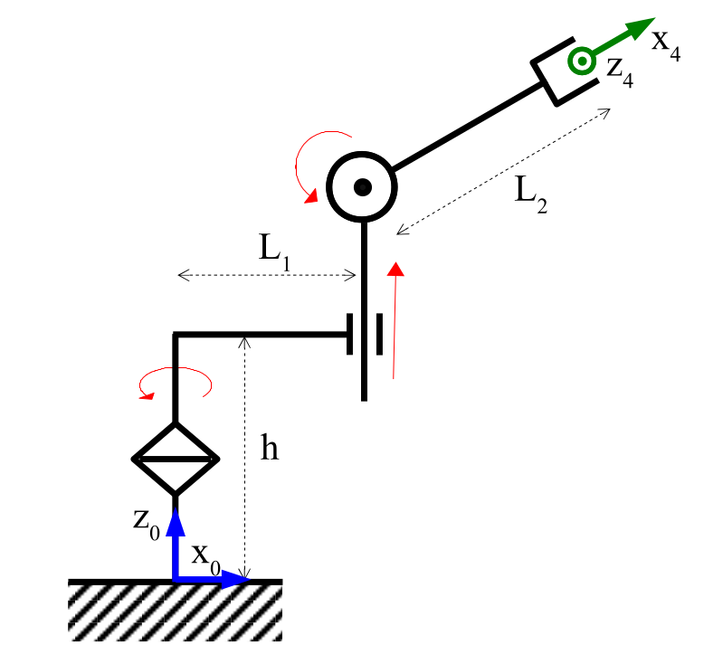
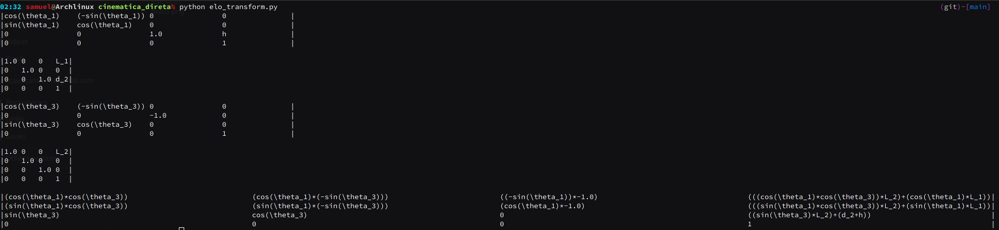

# Simbolic Matrix solver numpy

Uma simples lib para calculo de matrizes com variáveis simbolicas utilizado na
disciplina de introdução a robótica, para o calculo da cinemática direta de um
braço robótico




[exercicio_braço_robotico.pdf](docs/Avaliao_Semanal_sobre_cinemtica_direta.pdf)


| $`i`$ | $`a_{i-1}`$ | $`\alpha_{i-1}`$ | $`d_{i}`$ | $`\theta_i`$ |
| ----- | ----------- | ---------------- | --------- | ------------ |
| 1     | $`0`$       | $`0`$            | $`h`$     | $`\theta_1`$ |
| 2     | $`L_1`$     | $`0`$            | $`d_2`$   | $`0`$        |
| 3     | $`0`$       | $`90`$           | $`0`$     | $`\theta_3`$ |
| 4     | $`L_2`$     | $`0`$            | $`0`$     | $`0`$        |

 
```python3
# elo_transform.py
 matrix_1 = ExpressionMatrix.from_joinTransform(
        a=Expression(0),
        alpha=Angle.from_degree(0),
        d=Expression('h'),
        theta=Expression('\\theta_1')
    )

    matrix_2 = ExpressionMatrix.from_joinTransform(
        a=Expression('L_1'),
        alpha=Angle.from_degree(0),
        d=Expression('d_2'),
        theta=Angle.from_degree(0)
    )

    matrix_3 = ExpressionMatrix.from_joinTransform(
        a=Expression(0),
        alpha=Angle.from_degree(90),
        d=Expression(0),
        theta=Expression('\\theta_3')
    )

    matrix_4 = ExpressionMatrix.from_joinTransform(
        a=Expression('L_2'),
        alpha=Angle.from_degree(0),
        d=Expression(0),
        theta=Angle.from_degree(0)
    )

    print(matrix_1, end='\n\n')

    print(matrix_2, end='\n\n')

    print(matrix_3, end='\n\n')

    print(matrix_4, end='\n\n')

    result = ((matrix_1 * matrix_2) * matrix_3) * matrix_4

    print(result)

```

```zsh
python3 elo_transform.py
```

